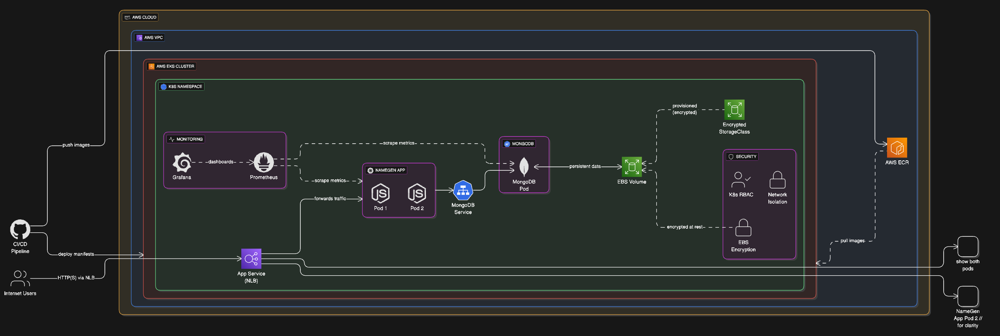

# 🚀 DevOps Final Project - Team 2

## 🌐 Overview

A **cloud-native Name Generation App** demonstrating modern DevOps practices—container orchestration, CI/CD pipelines, Infrastructure-as-Code (IaC), end-to-end monitoring, and automated scaling, all running on AWS.

---

## 🏗️ Architecture

### 💡 System Architecture Diagram



### ⚙️ Application Flow

| Component       | Tech             | Purpose                     |
|-----------------|------------------|-----------------------------|
| Frontend        | HTML/CSS/JS      | Static UI                   |
| Backend         | Node.js/Express  | REST API                    |
| Database        | MongoDB          | Persistent storage          |
| Load Balancer   | AWS NLB          | Traffic routing             |
| Monitoring      | Prometheus/Grafana| Metrics & Visualization    |

---

## 🛠️ Stack & Tools

### 📦 Core Application

- **Runtime:** Node.js 18 LTS
- **Framework:** Express.js
- **Database:** MongoDB 3.6 (StatefulSet)
- **Mock Data:** Faker.js
- **Logging:** Winston

### 🛡️ DevOps & Cloud

- **Containerization:** Docker (multi-stage)
- **Container Registry:** AWS ECR
- **Orchestration:** Kubernetes (AWS EKS)
- **Infrastructure as Code:** eksctl
- **Storage:** AWS EBS (encrypted)
- **Load Balancing:** AWS NLB

### 🔹 Kubernetes Strategy

- Rolling updates (zero downtime)
- 2+ app replicas for HA; StatefulSet for DB
- Kubernetes-native service discovery
- RBAC for access control
- Non-root containers, VPC isolation, encrypted EBS volumes

### 📈 Monitoring

- **Metrics:** Prometheus
- **Dashboards:** Grafana
- **Logging:** Winston (structured)
- **App Health:** Liveness/readiness probes

---

## 🚦 Prerequisites

- [AWS CLI](https://docs.aws.amazon.com/cli/latest/userguide/getting-started-install.html) configured
- [kubectl](https://kubernetes.io/docs/tasks/tools/) installed
- [eksctl](https://docs.aws.amazon.com/eks/latest/userguide/eksctl.html) installed
- [Docker](https://docs.docker.com/get-docker/) (for local testing)

---

## ⚡ Quick Start

1. **Create EKS Cluster**
    ```bash
    eksctl create cluster -f clusters/team3_cluster.yaml
    kubectl get nodes
    ```

2. **Configure kubectl**
    ```bash
    aws eks update-kubeconfig --region us-west-2 --name team3-cluster
    ```

3. **Setup Storage Class**
    ```bash
    kubectl apply -f k8s_manifests/storage_svc.yaml
    ```

4. **Deploy MongoDB**
    ```bash
    kubectl apply -f k8s_manifests/db_deployment.yaml
    kubectl apply -f k8s_manifests/db_srvc.yaml
    ```

5. **Deploy Application**
    ```bash
    kubectl apply -f k8s_manifests/app_deployment.yaml
    kubectl apply -f k8s_manifests/app_srvc.yaml
    ```

6. **Verify Everything**
    ```bash
    kubectl get pods
    kubectl get services
    kubectl get deployments
    kubectl get statefulsets
    ```

7. **Access the Application**
    ```bash
    kubectl get service namegen-team3-service
    # Visit http://<EXTERNAL-IP>/
    ```

---

## 📊 Monitoring & Observability

#### Install Prometheus & Grafana with Helm

```bash
# Add Prometheus Helm repo and install
helm repo add prometheus-community https://prometheus-community.github.io/helm-charts
helm install my-prometheus prometheus-community/prometheus --version 27.30.0

# Add Grafana Helm repo and install
helm repo add grafana https://grafana.github.io/helm-charts
helm install my-grafana grafana/grafana --version 9.3.2